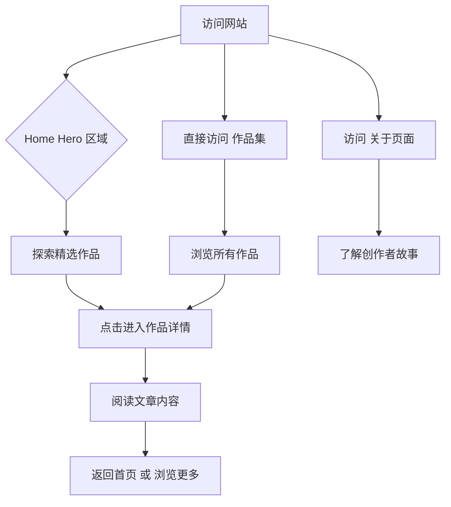

# 产品需求文档 (PRD)

## 1. 产品概述

**个人艺术博客网站** —— 一个融合视觉艺术与内容表达的独特个人空间，旨在展示创作者的思想、作品与故事。区别于传统的博客模板，这个网站将自身打造成一件数字艺术作品，让访客在浏览内容的同时体验沉浸式的视觉旅程。

- **核心目标**：为创作者提供一个兼具艺术美感与实用功能的个人展示平台
- **目标用户**：艺术家、设计师、摄影师、作家等创意工作者
- **核心价值**：将个人博客从信息载体提升为数字艺术品

---

## 2. 核心功能模块

### 2.1 功能模块列表

1. **首页 (Home)**：沉浸式艺术画廊风格的入口页面
2. **作品集 (Portfolio)**：展示创作者的代表作品/文章
3. **关于 (About)**：创作者个人介绍与故事
4. **文章详情 (Article Detail)**：博客文章阅读页面

### 2.2 页面详细功能

| 页面名称 | 模块名称 | 功能描述 |
|---------|---------|---------|
| 首页 | 艺术 Hero 区域 | 全屏艺术装置风格，动态粒子/几何图形背景，优雅的标题动画 |
| 首页 | 精选作品轮播 | 3D 透视卡片轮播，悬停时作品"浮出"效果 |
| 首页 | 最新动态 | 瀑布流布局的博客文章预览卡片 |
| 作品集 | 作品画廊 | 砖墙式布局，悬停时显示作品元数据，筛选标签 |
| 关于 | 个人故事 | 时间轴展示创作历程，图文结合的叙述方式 |
| 文章详情 | 文章内容 | 优雅的排版设计，支持代码高亮、图片灯箱 |
| 全局 | 导航系统 | 极简浮动导航，滚动时背景模糊效果 |

---

## 3. 核心交互流程

### 3.1 用户浏览流程



### 3.2 核心交互细节

- **首页 Hero**：加载时粒子系统从中心爆炸扩散，形成独特的视觉印记
- **作品悬停**：卡片 3D 翻转效果，展示作品简介和日期
- **页面切换**：优雅的淡入淡出配合微妙的视差滚动
- **导航交互**：滚动超过 100px 后导航栏变为毛玻璃效果

---

## 4. 用户界面设计

### 4.1 设计风格定位

**设计理念：有机未来主义 (Organic Futurism)**

融合自然有机的曲线形态与未来科技的几何感，创造出既温暖又前卫的视觉体验。

### 4.2 视觉规范

#### 色彩系统

```css
:root {
  /* 主色调：深空蓝 */
  --primary: #0a1628;
  
  /* 强调色：琥珀金 */
  --accent: #d4a574;
  
  /* 次要强调：薄荷绿 */
  --secondary: #7dd3c0;
  
  /* 背景：深邃黑 */
  --background: #050a12;
  
  /* 文字：柔和白 */
  --text: #e8e6e3;
  
  /* 渐变背景 */
  --gradient-hero: linear-gradient(135deg, #0a1628 0%, #1a2f4a 50%, #0d1f33 100%);
}
```

#### 字体系统

- **标题字体**：Playfair Display（衬线体，优雅经典）
- **正文字体**：Source Sans 3（无衬线，清晰现代）
- **艺术字体**：Cormorant Garamond（用于特殊强调，文艺气息）

#### 布局风格

- **首页**：全屏沉浸式 Hero + 非对称网格内容区
- **作品集**：瀑布流 + 悬浮交互
- **整体**：大量留白 + 精致细节

#### 动效哲学

- **入场动画**：优雅的淡入上移，间隔 100ms 依次出现
- **悬停效果**：3D 变换 + 微妙的阴影变化
- **滚动效果**：视差滚动 + 渐入渐出
- **页面切换**：300ms 优雅过渡

### 4.3 响应式策略

- **桌面优先** (1200px+)：完整体验，非对称布局
- **平板适配** (768px-1199px)：简化布局，保持核心动效
- **移动端优化** (< 768px)：单列布局，触摸友好，简化粒子效果

---

## 5. 技术实现要求

### 5.1 技术栈

- **纯前端实现**：HTML5 + CSS3 + Vanilla JavaScript
- **无框架依赖**：保持轻量级，便于部署到 GitHub Pages
- **外部资源**：仅使用 Google Fonts 和必要图标库

### 5.2 性能目标

- 首屏加载时间 < 2s
- 流畅的 60fps 动画
- 良好的 SEO 基础结构

---

## 6. 上线部署

按照标准流程将网站部署到 GitHub Pages：

1. 创建 GitHub 仓库
2. 初始化 Git 并提交代码
3. 推送到远程仓库
4. 在 GitHub 设置中启用 GitHub Pages
5. 网站即可通过 `username.github.io/repository-name` 访问
