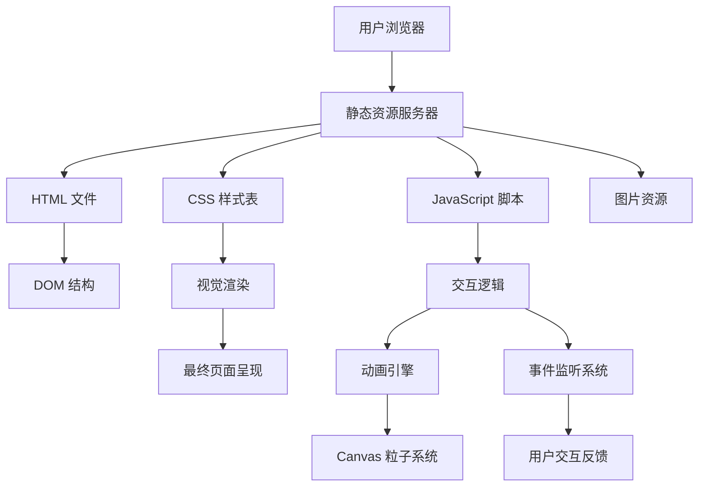

# 技术架构文档

## 1. 架构设计概览

### 1.1 系统架构



### 1.2 架构特点

- **零后端依赖**：纯静态网站，可直接部署到任意静态服务器
- **模块化结构**：CSS 和 JS 按功能模块分离
- **渐进增强**：基础功能优先，高级效果渐进加载

---

## 2. 技术栈详情

### 2.1 前端技术

- **HTML5**：语义化标签，良好的 SEO 结构
- **CSS3**：
  - CSS Grid + Flexbox 布局系统
  - CSS Variables 主题管理
  - CSS Animations + Transitions 动画效果
  - backdrop-filter 毛玻璃效果
  - 3D Transforms 立体交互
- **JavaScript (ES6+)**：
  - Vanilla JS，无框架依赖
  - Intersection Observer 滚动监听
  - Canvas API 粒子系统
  - 模块化代码组织

### 2.2 外部资源

#### 字体库

- **Playfair Display**：Google Fonts，衬线体标题
- **Source Sans 3**：Google Fonts，无衬线正文
- **Cormorant Garamond**：Google Fonts，艺术强调

#### 图标库

- **Lucide Icons**：轻量级 SVG 图标库（CDN 加载）

---

## 3. 文件结构

```
/workspace/
├── index.html              # 首页
├── portfolio.html          # 作品集页面
├── about.html              # 关于页面
├── article.html            # 文章详情页
│
├── /css/
│   ├── main.css            # 全局样式
│   ├── variables.css       # CSS 变量定义
│   ├── typography.css       # 字体排版系统
│   ├── components.css       # 可复用组件样式
│   ├── animations.css      # 动画定义
│   └── responsive.css       # 响应式样式
│
├── /js/
│   ├── main.js             # 主入口文件
│   ├── particles.js         # 粒子系统
│   ├── animations.js        # 动画控制器
│   ├── navigation.js        # 导航系统
│   └── scroll-effects.js    # 滚动效果
│
├── /assets/
│   ├── /images/             # 图片资源
│   └── /icons/              # 图标资源
│
├── /documents/              # 文档目录（不包含在网站构建中）
│
├── README.md                # 项目说明
└── .gitignore               # Git 忽略配置
```

---

## 4. 路由定义

### 4.1 页面路由

| 路由 | 页面名称 | 描述 |
|-----|---------|------|
| `/index.html` | 首页 | 艺术 Hero + 精选作品 + 最新文章 |
| `/portfolio.html` | 作品集 | 全部作品画廊展示 |
| `/about.html` | 关于 | 创作者个人介绍 |
| `/article.html` | 文章详情 | 单篇文章阅读页面 |

### 4.2 导航结构

```
导航栏
├── 首页 (Home)
├── 作品集 (Portfolio) 
├── 关于 (About)
└── 联系方式 (Contact)
```

---

## 5. CSS 架构

### 5.1 CSS 变量系统

```css
/* 颜色系统 */
--primary: #0a1628;
--accent: #d4a574;
--secondary: #7dd3c0;
--background: #050a12;
--text: #e8e6e3;

/* 间距系统 */
--space-xs: 0.25rem;
--space-sm: 0.5rem;
--space-md: 1rem;
--space-lg: 2rem;
--space-xl: 4rem;
--space-xxl: 8rem;

/* 字体系统 */
--font-display: 'Playfair Display', serif;
--font-body: 'Source Sans 3', sans-serif;
--font-accent: 'Cormorant Garamond', serif;

/* 动画时长 */
--transition-fast: 150ms;
--transition-normal: 300ms;
--transition-slow: 500ms;
```

### 5.2 组件系统

- **Hero**：全屏艺术区域组件
- **Card**：作品/文章卡片组件
- **Navigation**：导航栏组件
- **Timeline**：时间轴组件
- **Button**：按钮组件库

---

## 6. JavaScript 架构

### 6.1 模块划分

- **particles.js**：Canvas 粒子系统，负责首页背景动效
- **animations.js**：统一的动画控制器，管理入场动画和交互动画
- **navigation.js**：导航系统，处理滚动状态和移动端菜单
- **scroll-effects.js**：滚动监听，实现视差和渐入效果

### 6.2 主要功能

#### 粒子系统 (particles.js)

- 初始化粒子数量：50-100
- 粒子属性：位置、速度、大小、透明度、颜色
- 动画循环：requestAnimationFrame
- 鼠标交互：鼠标移动时粒子产生排斥/吸引效果

#### 滚动效果 (scroll-effects.js)

- Intersection Observer 监听元素可见性
- 元素进入视口时触发入场动画
- 导航栏背景模糊效果
- 视差滚动深度效果

---

## 7. 部署方案

### 7.1 GitHub Pages 部署流程

1. **创建仓库**：在 GitHub 创建新仓库
2. **初始化**：
   ```bash
   git init
   git add .
   git commit -m "feat: initial release"
   ```
3. **推送**：
   ```bash
   git remote add origin https://github.com/username/repository.git
   git branch -M main
   git push -u origin main
   ```
4. **启用 Pages**：在仓库 Settings → Pages → Source 选择 main branch
5. **访问网站**：`https://username.github.io/repository-name`

### 7.2 自定义域名（可选）

- 在 DNS 设置中添加 CNAME 记录
- 在仓库根目录添加 CNAME 文件
- 在 GitHub Pages 设置中配置自定义域名

---

## 8. 性能优化策略

### 8.1 资源优化

- 图片使用 WebP 格式或 SVG
- CSS 和 JS 文件最小化
- 字体使用 `font-display: swap`
- 延迟加载非首屏图片

### 8.2 动画性能

- 使用 `transform` 和 `opacity` 实现动画（GPU 加速）
- 粒子系统使用 Canvas 而非 DOM
- 低性能设备自动降级动画效果

### 8.3 加载策略

- 首屏关键资源优先加载
- 非关键资源延迟加载
- 骨架屏或加载动画提升感知性能
